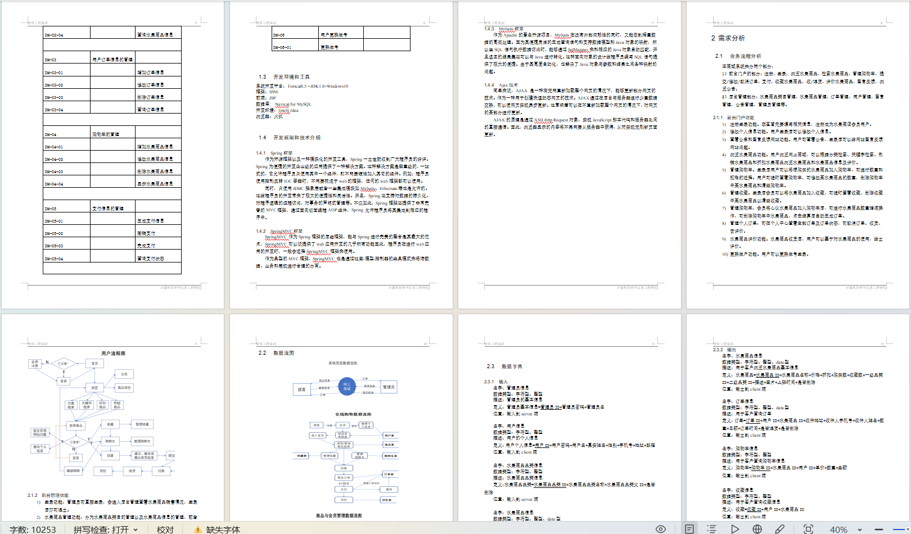
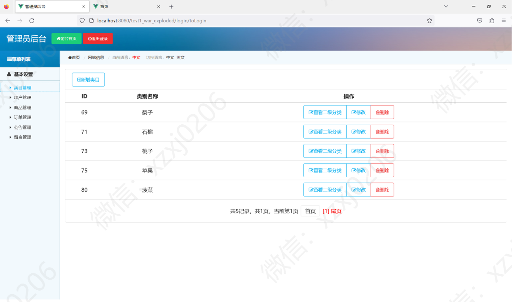
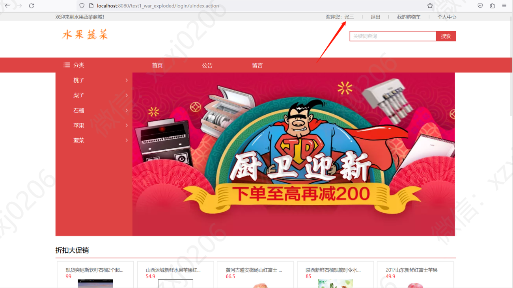
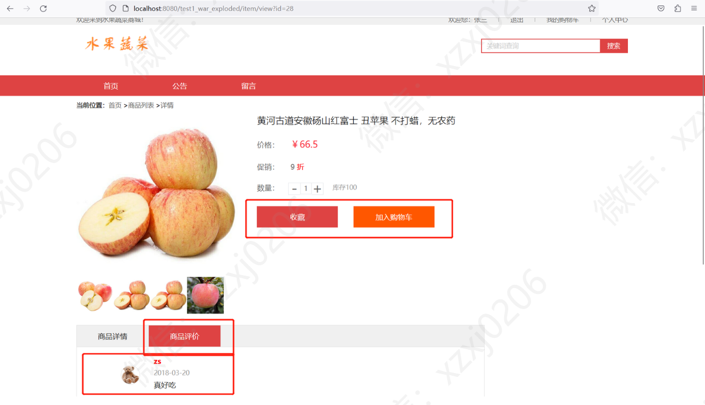
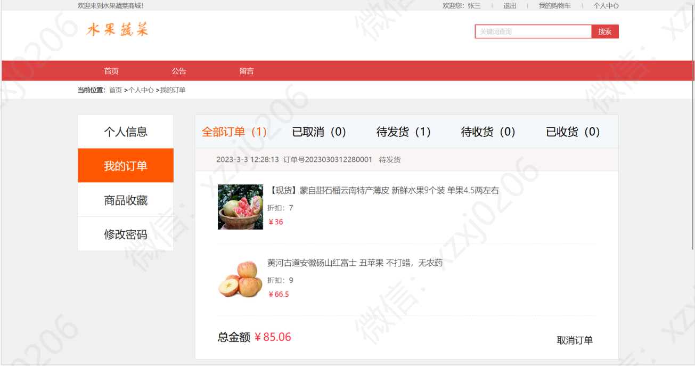
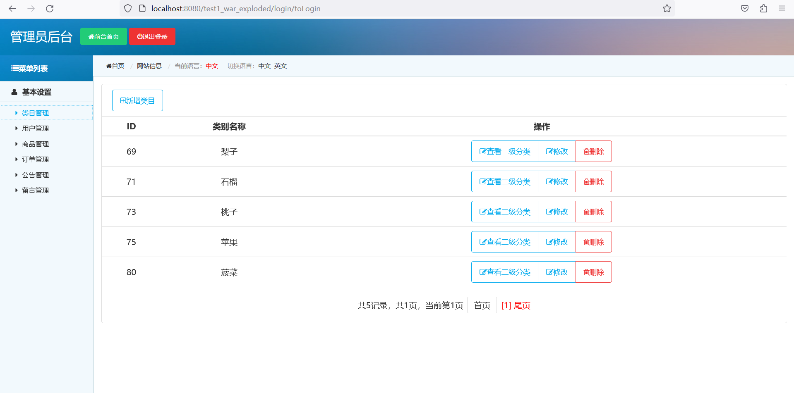
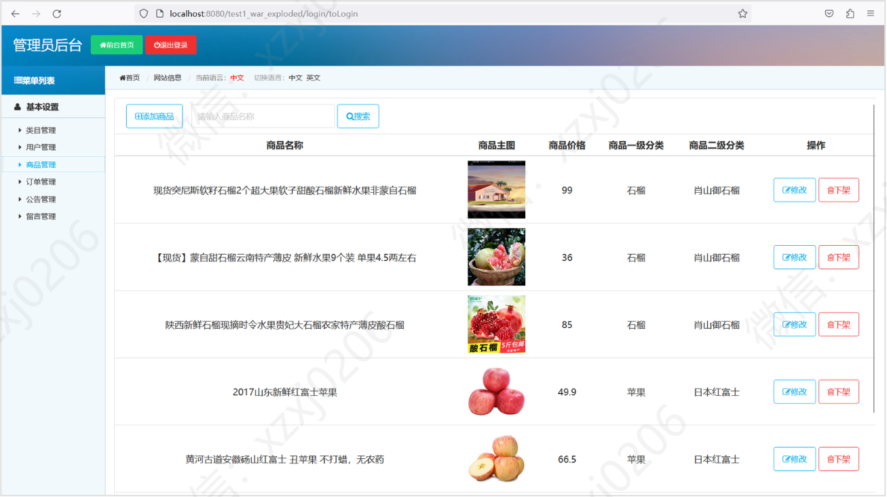
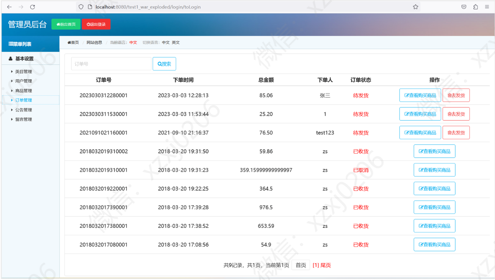
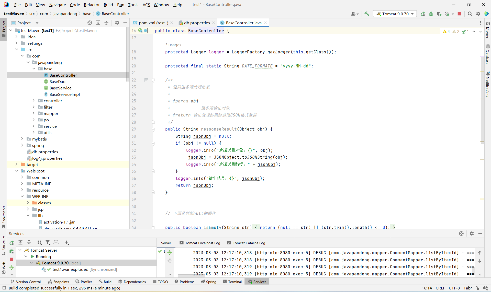

# 水果商城带万字文档

### 完整项目获取

通过网盘分享的文件：水果蔬菜商城系统

链接: https://pan.baidu.com/s/16pfNx7AXE-BqlrP1WLxFKw?pwd=mvch 提取码: mvch --来自百度网盘超级会员v3的分享

通过网盘分享的文件：工具包

链接: https://pan.baidu.com/s/1YmdoJvkjoUjA75wvHLDZ6A?pwd=xm96 提取码: xm96
--来自百度网盘超级会员v3的分享

需要远程项目部署或项目修改和毕业设计也可联系（添加申请时请备注好来意）

通过网盘分享的文件：远程调试部署联系方式

链接: https://pan.baidu.com/s/1W0dDcoZmayG0c7USJDYBYg?pwd=nqd7 提取码: nqd7
--来自百度网盘超级会员v3的分享

### 项目合集(项目不断更新中)
链接: https://pan.baidu.com/s/1nY-zhvAK0CXYcn3g7LzQnQ?pwd=id3c 提取码: id3c
--来自百度网盘超级会员v3的分享

#### 这些项目一起发你了 可以分享给你需要的同学 调试可找我 也接二次修改和项目定制、毕业设计等

## 接毕业设计和论文

微信联系方式：xzxj0206  QQ：3808981644   (支持修改、 部署调试、 支持代做毕设)

接网站建设、小程序、H5、APP、各种系统等，单片机、嵌入式也可以做

选题+开题报告+任务书+程序定制+安装调试+论文+答辩ppt  都可以做

### 一、介绍

基于Spring+SpringMVC+Mybatis+jsp的水果商城

语言：java

运行工具：idea或eclipse 数据库：mysql

万字论文

### 二、本项目分为前后台，有管理员与用户两种角色；
#### 1、管理员角色包含以下功能：
六大功能模块：类目管理、用户管理、商品管理、订单管理、公告管理、评论管理

#### 2、用户角色包含以下功能：
1、用户登录/注册 2、查看首页 3、查看商品详情 

4、查看购物车 5、提交订单 6、修改个人信息 

7、修改密码 8、查看我的订单 9、添加配送地址 

10、查看收藏夹等功能 11、搜索商品 12、查看公告 13、评论留言 14、商品收藏

### 三、用户功能部分页面展示

### 四、管理员功能部分页面展示

### 9.9￥ 获取完整源码+sql，需要加Q：3577148218 ,备用Q: 3808981644

