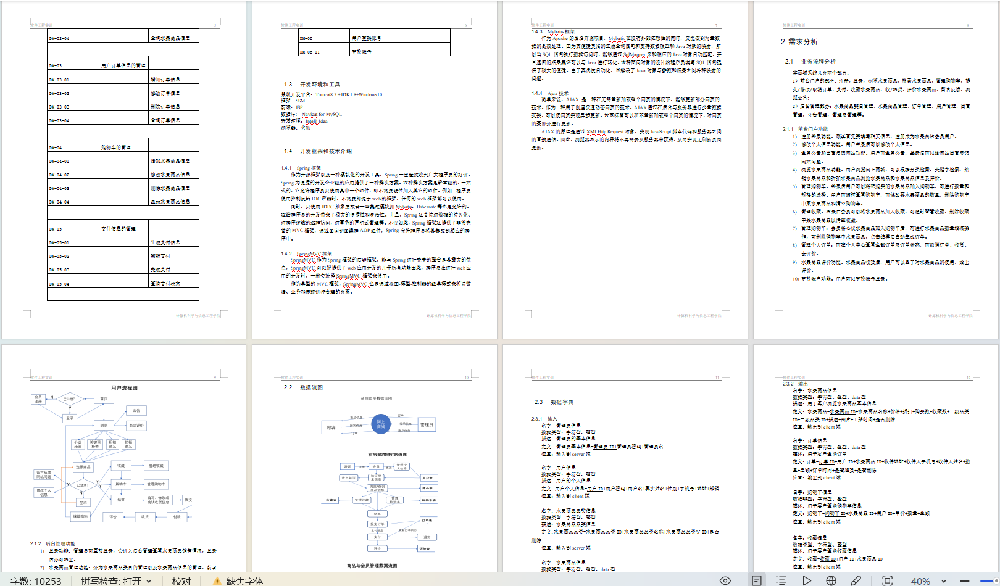

# 水果商城

### 9.9￥ 获取完整源码+sql，需要加Q：3577148218 ,备用Q: 3808981644
### 有问题，或者需要协助调试运行项目的也可联系

### 一、介绍

基于Spring+SpringMVC+Mybatis+jsp的水果商城

语言：java

运行工具：idea或eclipse 数据库：mysql

万字论文

### 二、本项目分为前后台，有管理员与用户两种角色；
#### 1、管理员角色包含以下功能：
六大功能模块：类目管理、用户管理、商品管理、订单管理、公告管理、评论管理

#### 2、用户角色包含以下功能：
1、用户登录/注册 2、查看首页 3、查看商品详情 

4、查看购物车 5、提交订单 6、修改个人信息 

7、修改密码 8、查看我的订单 9、添加配送地址 

10、查看收藏夹等功能 11、搜索商品 12、查看公告 13、评论留言 14、商品收藏

### 三、用户功能部分页面展示

### 四、管理员功能部分页面展示

### 9.9￥ 获取完整源码+sql，需要加Q：3577148218 ,备用Q: 3808981644

